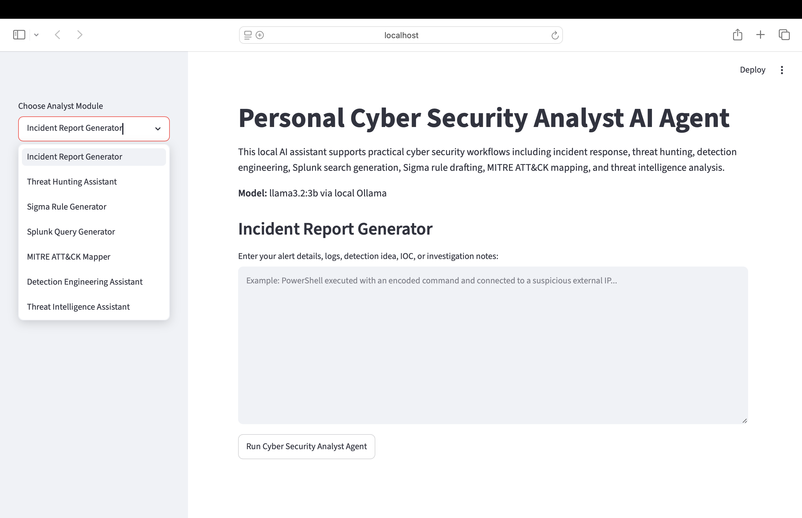
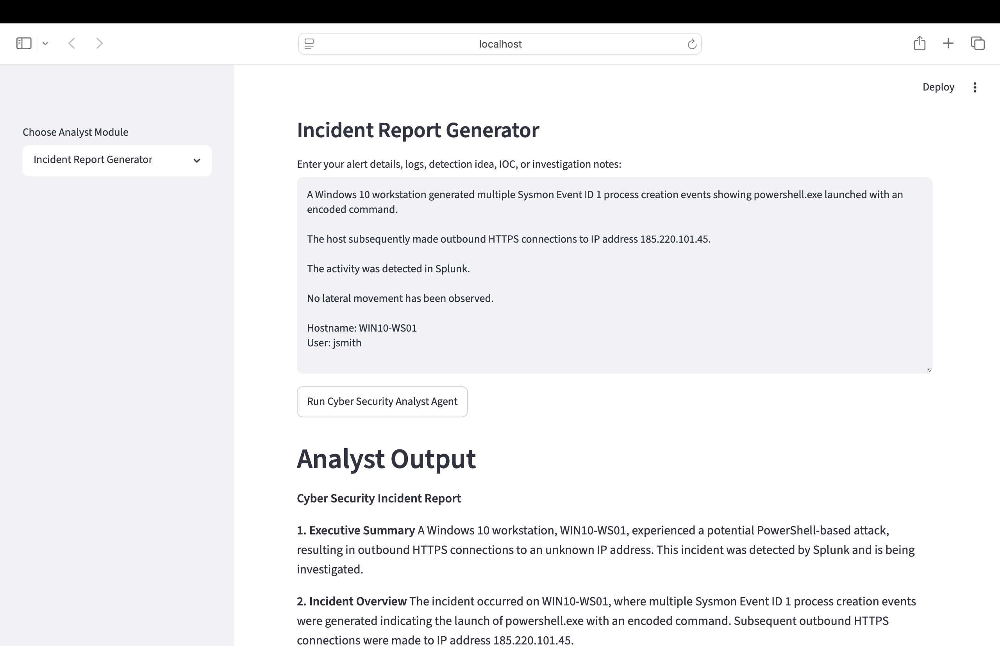
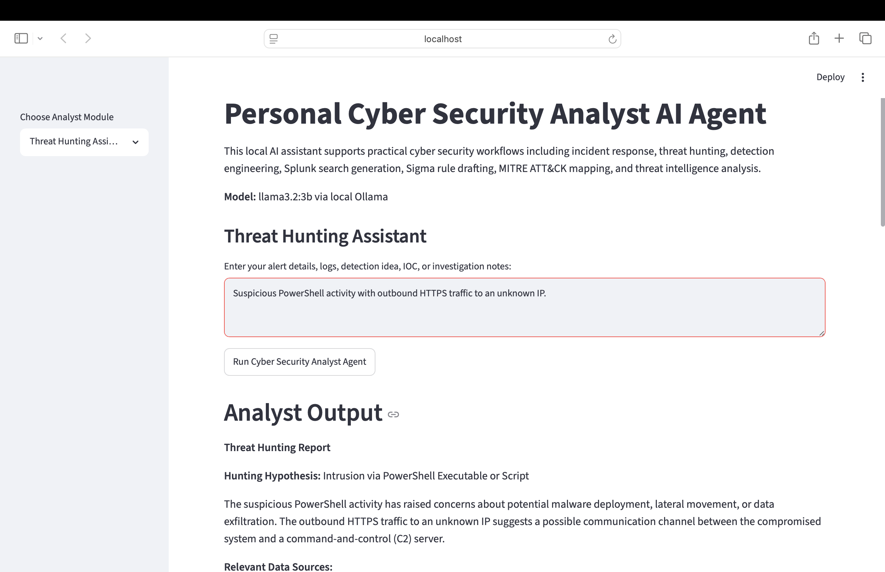
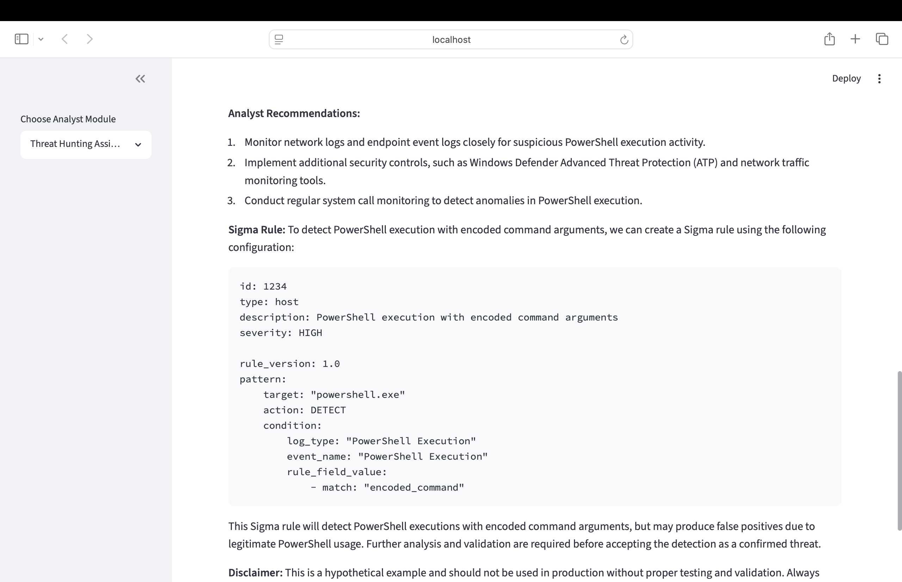
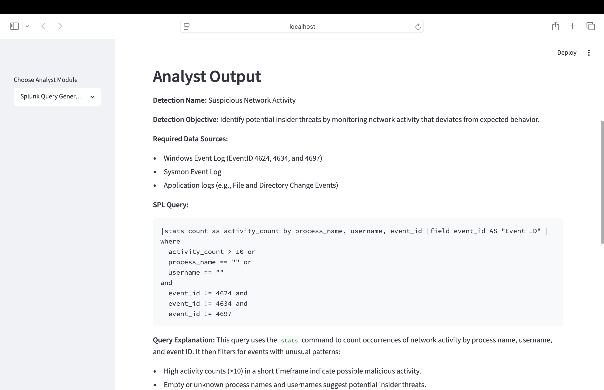
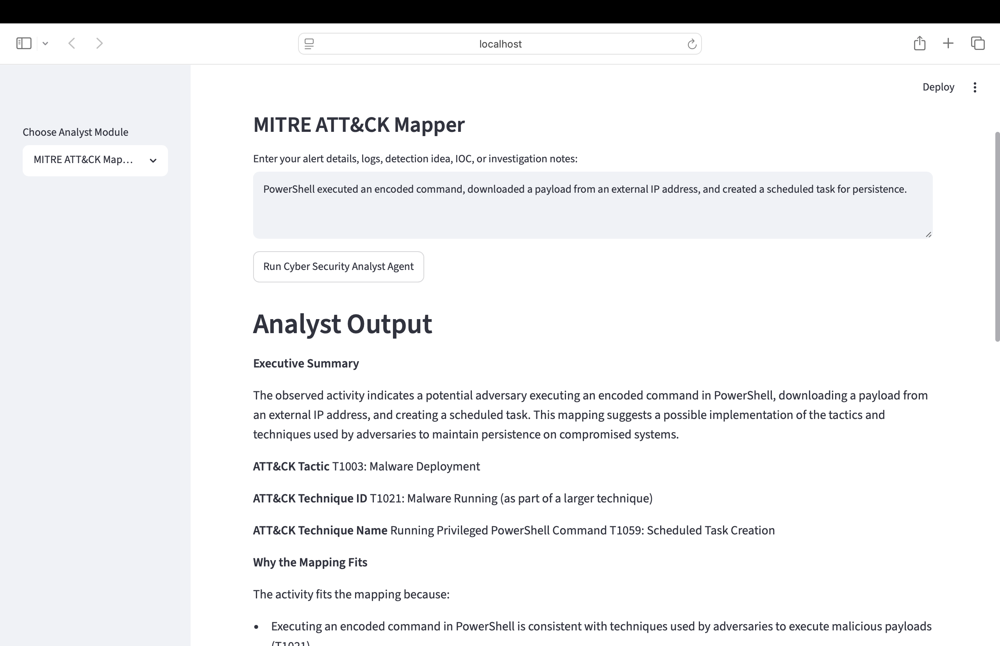
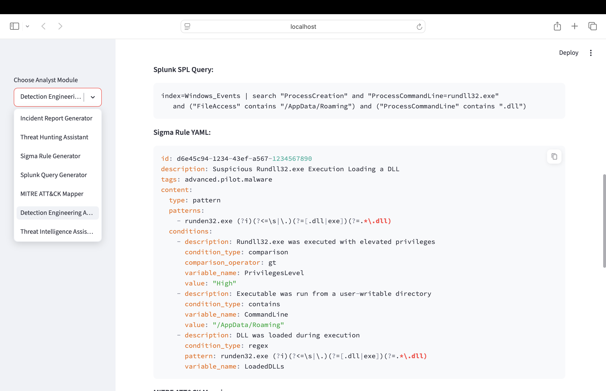
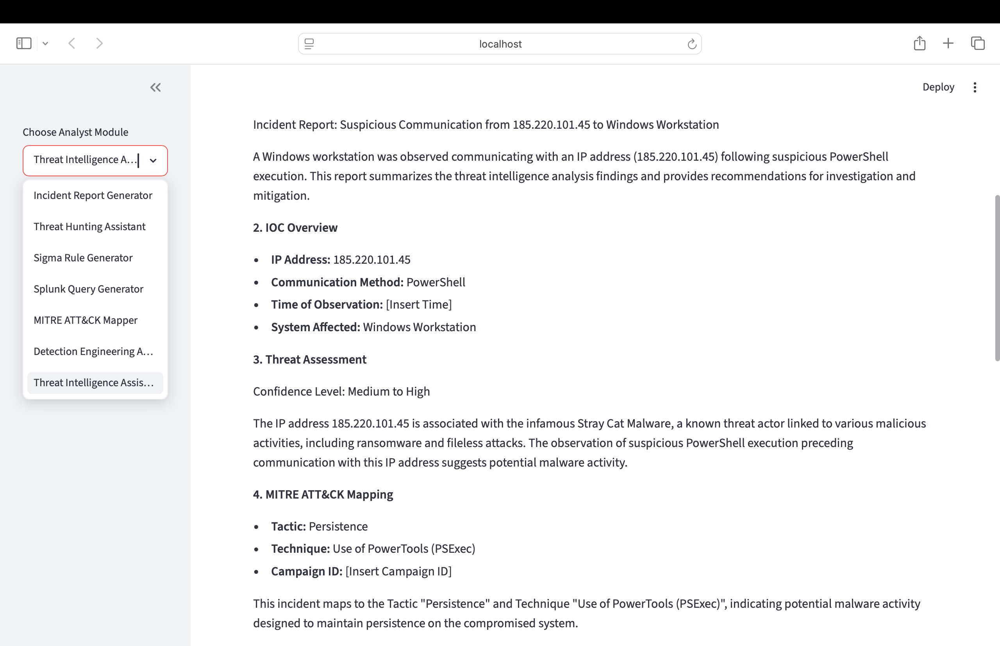
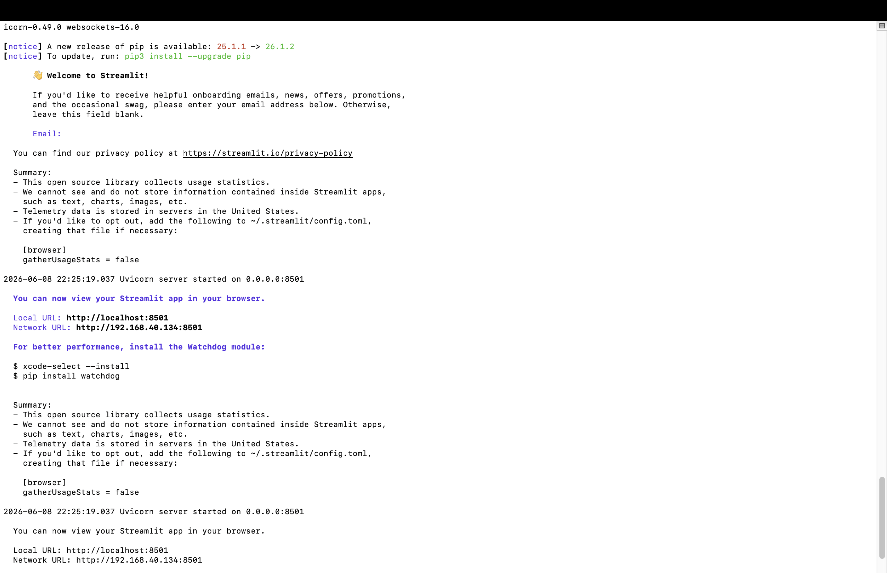
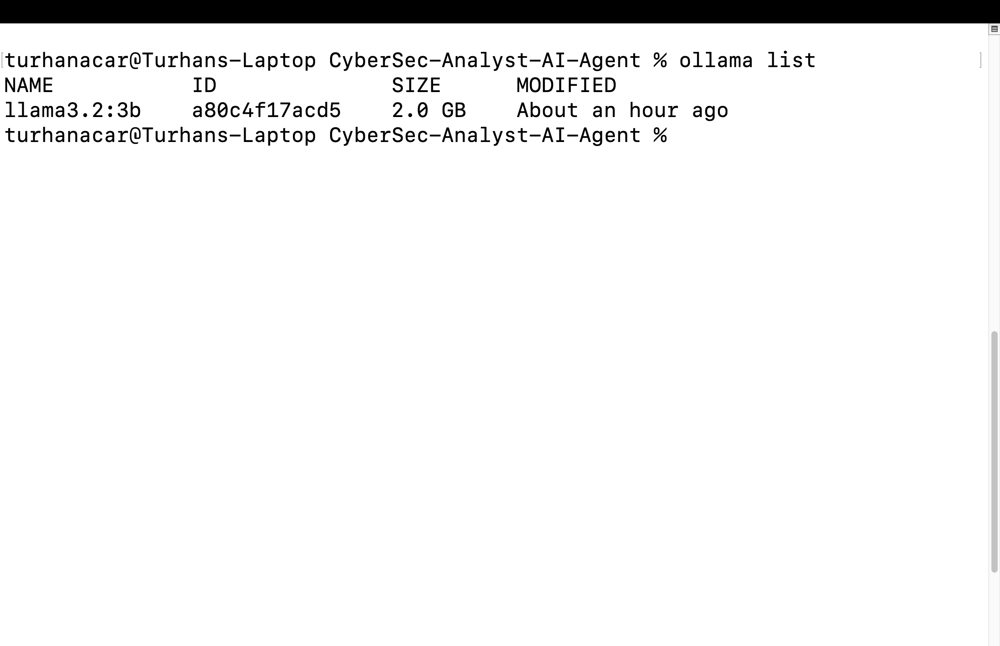

# Personal Cyber Security Analyst AI Agent

## Overview

The Personal Cyber Security Analyst AI Agent is a locally hosted AI-powered cyber security assistant designed to support defensive security operations, threat hunting, detection engineering, incident response, MITRE ATT&CK mapping, and threat intelligence workflows.

The application uses Streamlit for the user interface and Ollama with Llama 3.2 for local AI processing. All analysis is performed locally without requiring cloud-based AI services.

---

## Features

### Incident Report Generator

Generate structured cyber security incident reports from alerts, logs, and investigation findings.

### Threat Hunting Assistant

Create hunting hypotheses, identify relevant data sources, and generate investigation workflows.

### Sigma Rule Generator

Generate Sigma detection rules with ATT&CK mapping, false positive analysis, and tuning recommendations.

### Splunk Query Generator

Create Splunk SPL queries for defensive monitoring and threat detection.

### MITRE ATT&CK Mapper

Map observed behaviours to ATT&CK tactics and techniques.

### Detection Engineering Assistant

Generate detection logic, Sigma rules, Splunk queries, ATT&CK mappings, and validation guidance.

### Threat Intelligence Assistant

Support IOC analysis, threat assessment, investigation workflows, and enrichment opportunities.

---

## Architecture

```text
User
  │
  ▼
Streamlit Web Interface
  │
  ▼
Personal Cyber Security Analyst AI Agent
  │
  ▼
Ollama API
  │
  ▼
Llama 3.2 Local Model
  │
  ├── Incident Report Generator
  ├── Threat Hunting Assistant
  ├── Sigma Rule Generator
  ├── Splunk Query Generator
  ├── MITRE ATT&CK Mapper
  ├── Detection Engineering Assistant
  └── Threat Intelligence Assistant
```

---

## Technology Stack

* Python
* Streamlit
* Ollama
* Llama 3.2
* MITRE ATT&CK
* Sigma
* Splunk SPL

---

## Screenshots

### Homepage



### Incident Report Generator



### Threat Hunting Assistant



### Sigma Rule Generator



### Splunk Query Generator



### MITRE ATT&CK Mapper



### Detection Engineering Assistant



### Threat Intelligence Assistant



### Local Streamlit Deployment



### Local Ollama Model



---

## Installation

See:

```text
docs/installation.md
```

---

## Use Cases

See:

```text
docs/use_cases.md
```

---

## Security Considerations

* Outputs should be validated by a human analyst.
* AI-generated content should not be considered evidence without verification.
* Designed for defensive cyber security use cases.
* Authentication is not implemented in version 1 because the application is intended to run locally in a lab environment.

---

## Future Enhancements

* MISP integration
* Sigma rule export
* Incident report export
* IOC enrichment workflows
* Vector database integration
* Knowledge base support
* Multi-model support
* Authentication and user access control

---

## Disclaimer

This project is intended for educational, research, and defensive cyber security purposes only.

